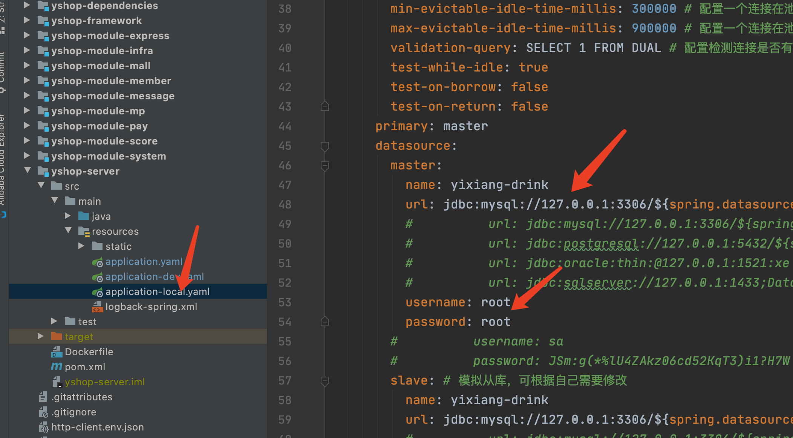
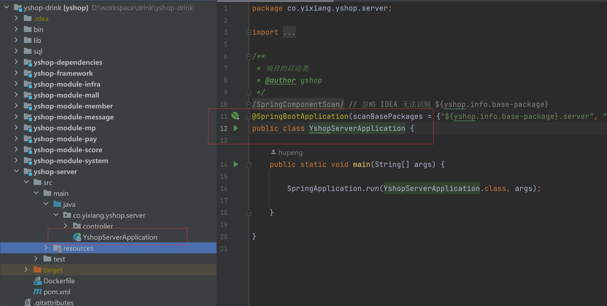
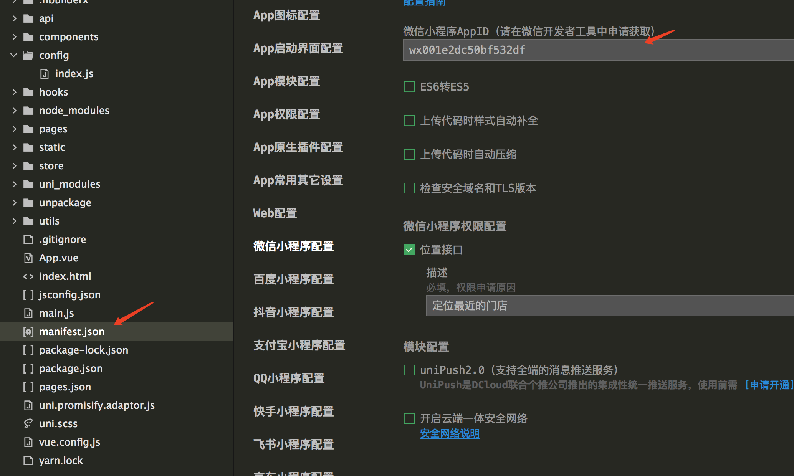
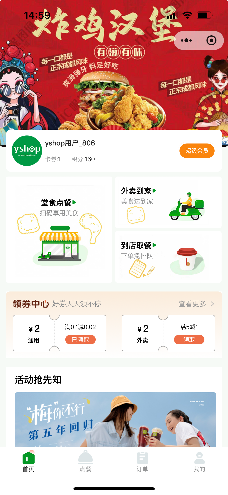
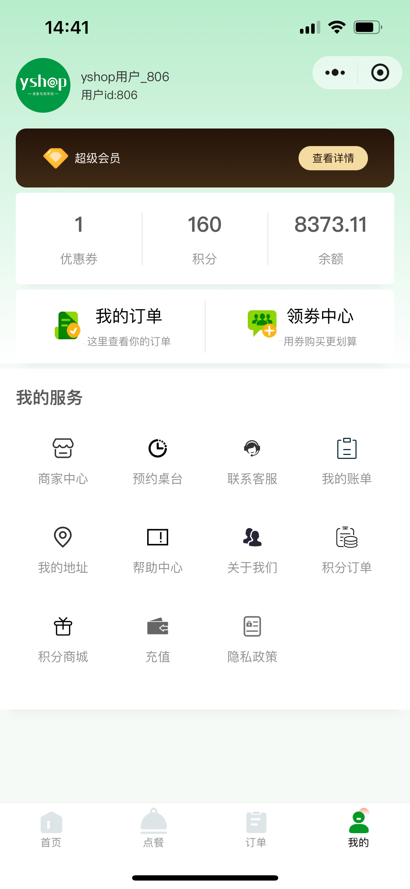
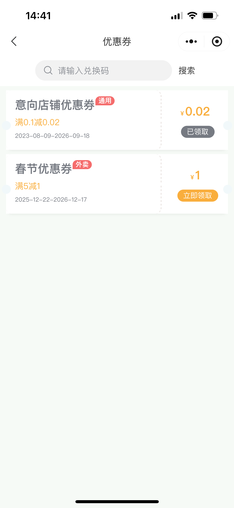
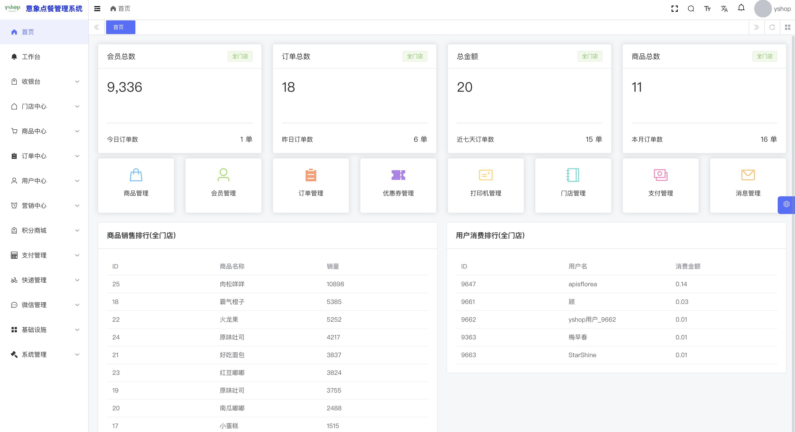
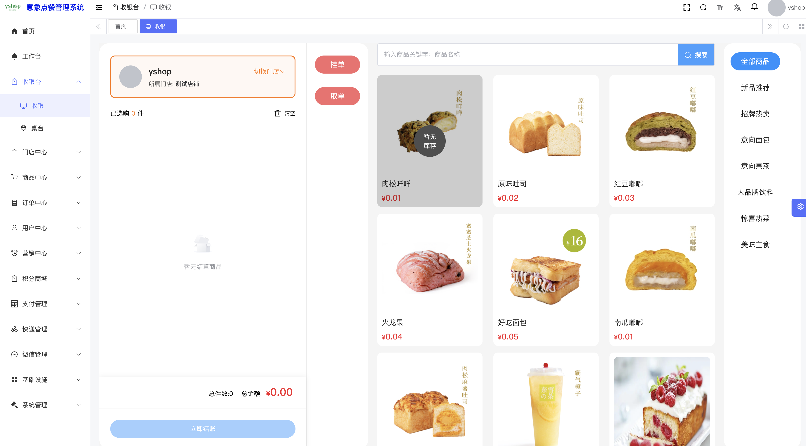

## 平台简介

**点餐管理系统**（扫码点餐）：在线点餐（外卖与自取）小程序模式，支持多门店、SaaS 多租户；技术栈为 Java 17、Spring Boot 3、Vue3、uni-app（Vue3，支持 H5、微信小程序）。

采用前后端分离架构：Spring Boot 3、Spring Security、OAuth2、MyBatis-Plus、JWT、Redis、Vue3 等。

功能包含外卖与自取、商品管理（多规格 SKU）、店铺管理、云小票打印、图片素材库、订单管理、积分兑换、充值、优惠券、多门店、微信公众号、商家中心、预约取餐、桌面扫码点餐、收银台、会员卡、桌台点餐等，适合二次开发与私有化部署。

部署后请通过自建域名访问管理后台与 H5/小程序，并在各环境配置文件中填写实际地址。


## 演示说明

本地或自建环境启动后，按控制台与数据库初始账号登录（常见默认为 `admin` / `admin123`，请以实际导入 SQL 与配置为准）。

## 视频资料
如果对您有帮助，您可以点右上角 "Star" 支持一下，这样我们才有继续免费下去的动力，谢谢！ QQ交流群 (入群前，请在网页右上角点 "Star" )，群里有视频教程与开发文档哦！！

交流QQ群：544263002

## 项目说明
    

```
    yshop-drink.             Java工程
    yshop-drink-vue          后台前端vue3工程
    yshop-drink-uniapp-vue3  移动端uniapp(vue3版本)工程，支持微信小程序、h5
```


## 本地快速启动
  ##### 1、环境要求
   
    ```
        jdk17
        mysql8
        redis6+
        node16+
        maven3.8+
    
    ```
  ##### 2、开发工具
   
    ```
        idea
        vscode
        hbuilder
    
    ```
 ##### 3、后端启动


-   3.1 请使用idea打开Java工程，自动会安装依赖
-   3.2 创建数据库且导入工程目录下sql/yixiang-drink.sql 文件
-   3.3 找到项目下的yshop-server 的yml,修改数据库相关信息和redis相关信息，如图：
     
-   3.4 工程下输入
    ``` 
    mvn clean install package '-Dmaven.test.skip=true
    ```
-   3.5 启动项目，如图
    

##### 4、后台vue启动

 - 4.1 vscode 打开vue工程，在目录下输入命令: 
    ``` 
    pnpm install
    ```
 - 4.2 配置api如图
 
 - 4.3 本地启动:
    ```
     npm run dev
    ```

##### 5 移动端uniapp启动
 
  - 5.1 hbuilder导入uniapp项目，
  - 5.2 配置api
   
  - 5.3 配置小程序
   
  - 5.4 运行小程序
    
  - 5.5 运行h5
   
    
-


## 小程序截图

| |  |
|---|---|
|   |   |
|   |  | 

## 后台截图

|  | 
|---|---|
|   | 
|   | 
|   |  |


## 技术栈
- Spring Boot3

- Spring Security oauth2

- MyBatis

- MyBatisPlus

- Redis

- lombok

- hutool

- Vue3

- Element UI

- uniapp(vue3)

## 特别鸣谢


- ruoyi-vue-pro:https://gitee.com/zhijiantianya/ruoyi-vue-pro
- element-plus:https://element-plus.gitee.io/zh-CN/
- vue:https://cn.vuejs.org/
- pay-java-parent:https://gitee.com/egzosn/pay-java-parent
- uvui：https://www.uvui.cn/
- uniapp:https://uniapp.dcloud.net.cn/


## 开源协议

本项目采用比 Apache 2.0 更宽松的 [MIT License](https://gitee.com/guchengwuyue/yshop-drink/blob/master/LICENSE) 开源协议，个人与企业可 100% 免费使用，不用保留类作者、Copyright 信息。

